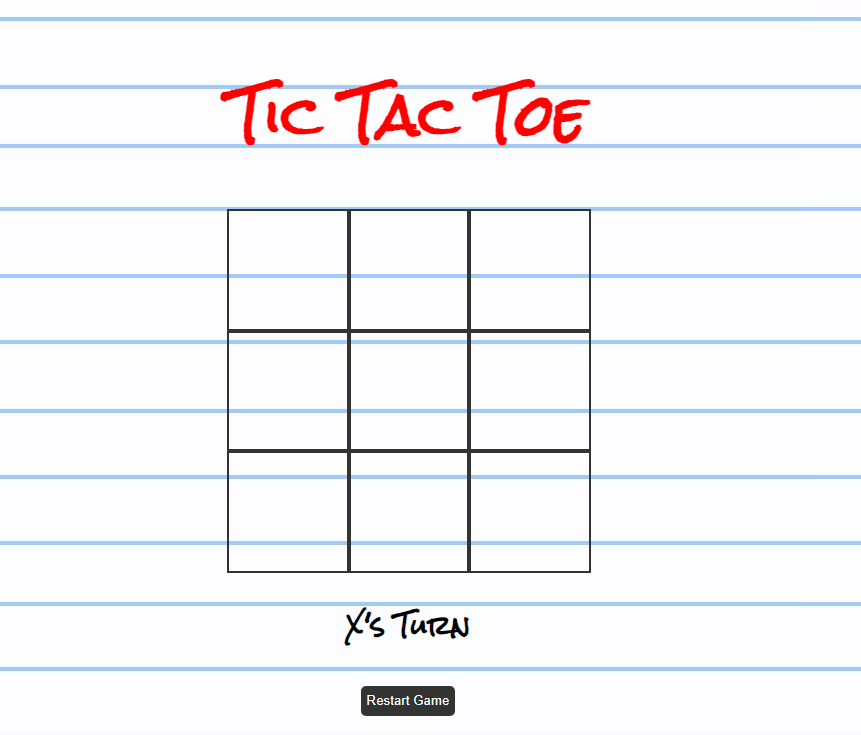
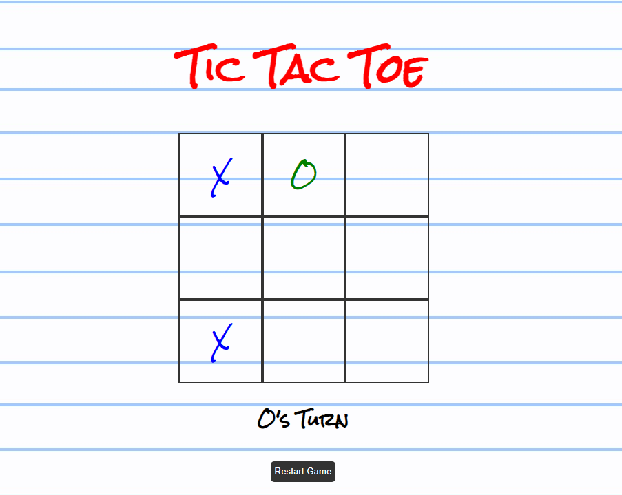
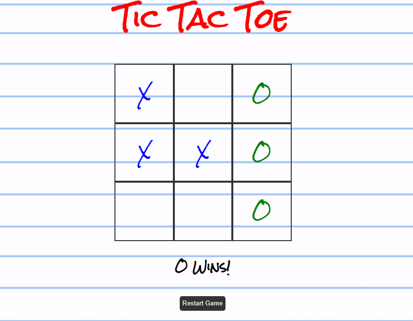
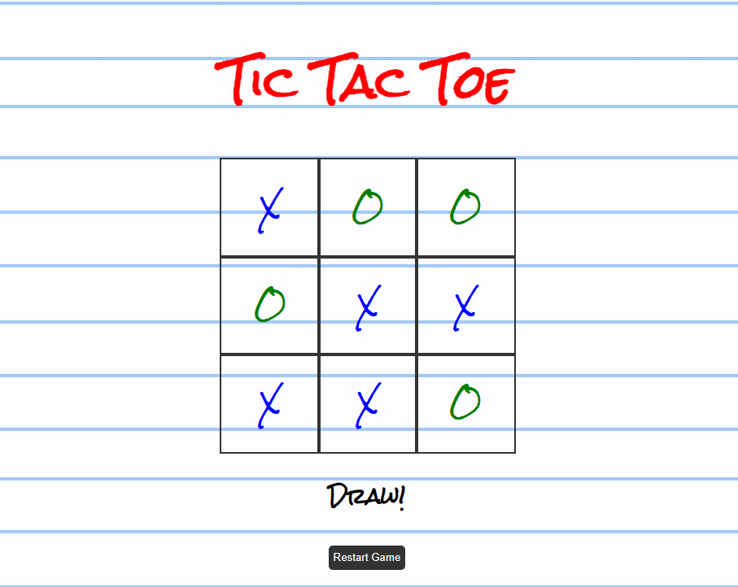
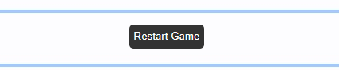

# TicTacToe
CSI 3140 Summer 2024

Jack Snelgrove 300247435

Sami Hassan 300169285

## Assignment 3: Tic Tac Toe Game PHP

### Running the Game
- Clone this repo
- run 'php -S localhost:8000`
- Open the browser and go to this site http://localhost:8000/index.html

### Summary
This version of our TicTacToe game is the game game but with the addition of a leaderboard and player names. 
Each player enters their name and then plays as many rounds as they want. When they finish the session, the top score of the two players is added to the leaderboard on the home screen.

We used a PHP server to store the information about each game, game session, and all-time best scores. The javascript file makes AJAX requests to the PHP server to know how to update the user interface. 

## Assignment 2: Tic Tac Toe Game

Summary:
For our assignment, we built a game called Tic Tac Toe, in which two players played on the same device.

The game starts by selecting a random player to play first, either X or O.

Each player takes turns selecting a cell to place their letter.

Either X wins, O wins, or the game ends in a draw.\

There is also a button at the buttom to reset the game either mid-round or at the end of the game.

